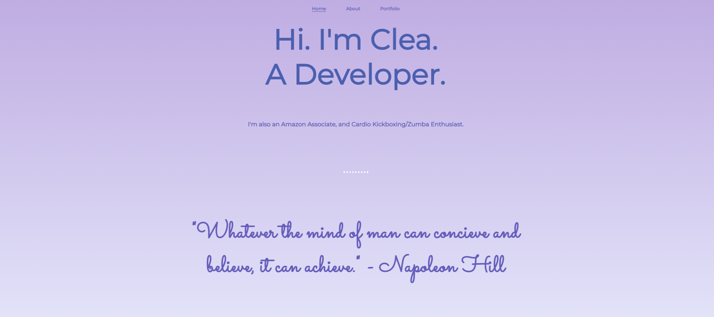

# MyPersonalWebsite

This is my Personal Website Project done as an assignment in my Fullstack Academy Course.

## Table of contents

- [Overview](#overview)
  - [Screenshot](#screenshot)
  - [Links](#links)
  - [Built with](#built-with)
  - [What I learned](#what-i-learned)
  - [Continued development](#continued-development)
  - [Useful resources](#useful-resources)
- [Author](#author)
- [Acknowledgments](#acknowledgments)

## Overview

The assignment was to create a Personal website with five pages: Index (landing), About, Portfolio, Javascript console, and a Contact page.

### Screenshot



### Links

- Solution URL: [Add solution URL here](https://github.com/Clea-Carty-Personal-Website/Clea-Carty-Personal-Website.git)
- Live Site URL: [Add live site URL here](https://clea-carty-personal-website.github.io/Clea-Carty-Personal-Website/)

### Built with

- HTML
- CSS
- CSS flex

### What I learned

I learned:

- How to add a border to a circle image
- How to shape corners using the 'border-radius' property
- How to style the font family using google fonts

```css
.this-property-was-fun {
  border-radius: 50%;
}
```

### Continued development

I would like to continue deepening my knowledge of HTML, CSS, Javascript as a short term goal, and subsequently learn other programming languages that would be useful for a career in web development.

### Useful resources

- [Example resource 1](https://www.flaticon.com/free-icon/github-logo_25231)- This website provided the github logo in the footer.
- [Example resource 2](https://www.flaticon.com/free-icon/linkedin_174857) - This webiste provided the linkedin logo in the footer.

## Author

- Website - Clea Carty(https://www.linkedin.com/in/clea-carty-50930a26/)
